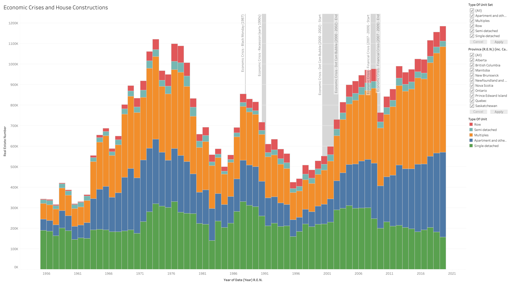

# Final-Project-Tableau

## Project/Goals
In this exercise, I chose Option 1 to answer a series of questions about the relationship between housing prices and residents' livelihoods through a comprehensive study and analysis of data such as the Canadian House Price Index, Consumer Price Index, real estate construction, prices, and monthly income of residents. This exercise is part of learning and mastering Tableau, a professional data analysis and visualization software.

The core files submitted include:
  - a PDF file of the presentation
  - the Tableau project file
  - a README.md file
  - the transformed data file in CSV format
  - the original data files in JSON and XLSX formats
  - the Python code used for data transformation
  - screenshots for this README.md file
---
## Process

* Data Extraction and Transformation using Python:
  - Convert JSON and XLXS files to CSV files.
  - Generate pivot tables using the .melt() method.
  - Convert weekly earnings data to monthly earnings data using the dt.daysinmonth() method.
* Load data into Tableau:
  - Use "Data Source" option to link tables.
  - Use Date fields to link the tables and set the data type to "Date."
  - Set Region/Province fields to data type "Geo."
* Create sheets and dashboards:
  - Use parameters for the start and end dates of four economic crises.
  - Create calculation fields for "Decade Classification"
* Pivot Tables in Tableau:
  - Convert column names to new dimensions.
  - Use new dimensions for filtering, coloring, and labeling.
  - Conforms to Tableau's workflow.
---
## Results
* I chose the option 1. The datasets used are:
  - Canadian House Price Index (HPI)
    - housing_price_index.csv
  - Consumer Price Index (CPI)
    - consumer_index.csv
  - Real Estate Construction
    - real_estate_numbers.csv
  - Real Estate Prices
    - real_estate_prices.xlsx
  - Monthly Earnings
    - weekly_earnings.json
  - Office Real Estate Index
    - office_realestate_index.csv
---
### Answers to Questions
* Show the trend of house prices across Canada in the last 40 years (table housing_price_index).
  - The trend of house prices across Canada over the past 40 years indicates a consistent overall increase.

<div style="text-align:center"></div>

* Compare the trend after 2005 with actual benchmark prices in table real_estate_prices to see if there are any differences.
  - The benchmark prices are more responsive to changes in the market, exhibiting a greater overall increase rate and amount in comparison to the HPI trend observed after 2005.
  - The apartment type has become the real estate type with the highest appreciation rate since August 2017. This trend implies that apartments are becoming increasingly expensive and in high demand, potentially due to various factors such as population growth, urbanization, and changes in market conditions.

<div style="text-align:center"></div>


* Compare this trend with the trend of office prices. Which one is getting more expensive, faster?
  - ***Shopping centers***, classified as office real estate, generally experience the highest appreciation rates compared to other types of office real estate. This trend is particularly pronounced after the Financial Crisis of 2007-2009.

<div style="text-align:center"></div>

* Create a heatmap of Canada with current house prices for each available district.
  - A heatmap is a powerful tool for effectively comparing numerical values across different geographic regions and categorical dimensions.
  - With the sorting button, users can quickly identify the ranking of regions for a specific property type. Moreover, the year-month slider enables easy navigation to a specific point in time, facilitating dynamic analysis of the data.

<div style="text-align:center"></div>

* Are the price differences between different districts increasing?
  - By plotting the boxplot of the price index from different regions over history, one can see statistical information such as standard deviation and interquartile range. Comparing the height of the box and the length of the interquartile range, it can be concluded that the price differences between different districts have been increasing.

<div style="text-align:center"></div>

* Compare the trend of house prices with earnings. *In case you want to plot monthly salary, be aware that the earnings value is per week.
  - The income growth level in Alberta province is significantly higher than in other provinces, and this growth rate has surpassed the HPI growth rate. This means that residents of Alberta province are more likely to cope with the economic burden brought by the rising property prices.

<div style="text-align:center"></div>

* Did people spend more of their earnings in 2014 than they did in 2001?
  - This question is essentially asking what percentage of one's income from 2001 to 2014 would be required to purchase a specific item.
  - To address this inquiry, we require the ratio of the Consumer Price Index (CPI) to the monthly earnings that have been normalized. Normalization is done by dividing the monthly earnings by the value of monthly earnings on July 1, 2002, when the CPI index was set to 100.
  - The purchasing power of people's monthly income has steadily increased. If the same goods need to be purchased, people spent less in 2014.
  - In addition, the HPI to CPI ratio is calculated by using in-shelf calculation, dividing the HPI by the CPI. 

<div style="text-align:center"></div>

<div style="text-align:center"></div>

* There were several economic crises in the world in the last 40 years, including these four: Black Monday (1987), Recession (early 1990s), dot com bubble (2000 - 2002), Financial crisis (2007 - 2009). Show the effect of these crises on:
  - Earnings
  - House prices
  - Office prices
  - House constructions
  - Consumer index

<div style="text-align:center"></div>

<div style="text-align:center"></div>

<div style="text-align:center"></div>

<div style="text-align:center"></div>

<div style="text-align:center"></div>

* Why is it not the case that every economic crisis affects all economic indicators in Canada?
  - Black Monday (1987)
    - The long-term effects of Black Monday (1987) on Canada were relatively limited. While the stock market crash had an immediate impact on the Canadian economy, it did not cause a prolonged recession or major structural changes. 
    - One reason for this is that the Canadian financial system was relatively well-regulated and stable at the time, which helped to mitigate the effects of the crash. 
    - Additionally, the Bank of Canada and other policymakers were able to respond quickly by implementing monetary and fiscal policies that helped to stabilize the economy. 
    - Overall, while Black Monday had a significant impact on Canada in the short term, its long-term effects were relatively limited.

  - Dot Com Bubble (2000 - 2002)
    - The dot com bubble was primarily a US phenomenon that affected mostly US-based tech companies and investors. 
    - The dot com bubble had a limited impact on the Canadian economy due to the country's lesser investment in the tech sector and the government's implementation of policies to stabilize the economy. Although there were still negative effects, such as reduced trade and demand for exports.

<div style="text-align:center"></div>

* Plot consumer_index together with housing_price_index and fit the regression line between them. Can we predict *onsumer_index from the housing_price_index?
  - The the scatter plot is colored by the decade classification.
    ```SQL
    IF YEAR(DATETRUNC('year',[Date])) < 1990 THEN '1980s'
      ELSEIF YEAR(DATETRUNC('year',[Date])) < 2000 THEN '1990s'
      ELSEIF YEAR(DATETRUNC('year',[Date])) < 2010 THEN '2000s'
      ELSEIF YEAR(DATETRUNC('year',[Date])) < 2020 THEN '2010s'
    ELSE '2020s'
    END
    ```
  - The results indicate that on the scatter plot, each decade shows a relatively independent and continuous sequence of segments.
  - If we evaluate the data over the 40-year period as a whole, we can see four trend lines from different CPI indicators that roughly point in the same direction.

<div style="text-align:center"></div>

  - However, if the short-term (10-year) trend lines are used, the direction of each trend line on the scatter plot for each decade is different in direction, which illustrates the difficulty in making long-term predictions.
 
<div style="text-align:center"></div>

  - Based on this observation, we can conclude that we may use this scatter plot for short-term trend forecasting, but predicting trends beyond a decade may be difficult due to the multiple factors influenced by domestic and international political and economic conditions.


---
## Challenges 
* Analyzing and interpreting complex data sets from various sources
* Identifying and understanding the relationship between different economic indicators such as housing prices, consumer prices, real estate construction, prices, and monthly income
* Making accurate predictions and long-term forecasts
* Effectively communicating the findings through data visualization and presentations
* Mastering professional data analysis and visualization software Tableau
---
## Future Goals
Next, I can consider completing the data transformation work within Tableau software. This will better simulate the actual workflow of extracting data from a database to analyze and display in Tableau while keeping the data in the database updated in real-time. Whenever the data in the database is updated, the Tableau dashboard can automatically display the updated charts and visualizations.

---
## Appendix

* To properly show the locations on the map, latitude and longitude values are required for those unrecognized locations. The following table shows the latitude and longitude values for some of the unrecognized locations.

    | Location                  | Latitude  | Longitude   |
    |---------------------------|----------|-------------|
    | Barrie and District       | 44.3894  | -79.6903    |
    | Brantford Region          | 43.1394  | -80.2644    |
    | Fraser Valley             | 49.2838  | -122.7010   |
    | Greater Moncton           | 46.0878  | -64.7782    |
    | Greater Toronto           | 43.6532  | -79.3832    |
    | Greater Vancouver         | 49.2827  | -123.1207   |
    | Grey Bruce Owen Sound     | 44.4268  | -81.3644    |
    | Guelph and District       | 43.5448  | -80.2482    |
    | Hamilton Burlington       | 43.2500  | -79.8662    |
    | Huron Perth               | 43.5500  | -81.3833    |
    | Kitchener Waterloo        | 43.4643  | -80.5204    |
    | London St Thomas          | 42.9849  | -81.2453    |
    | Lower Mainland            | 49.2827  | -123.1207   |
    | Montreal CMA              | 45.5017  | -73.5673    |
    | Newfoundland and Labrador | 53.1355  | -57.6604    |
    | Niagara Region            | 43.0896  | -79.0849    |
    | Northumberland Hills      | 44.1076  | -77.8418    |
    | Oakville Milton           | 43.5000  | -79.6667    |
    | Okanagan Valley           | 50.3573  | -119.2693   |
    | Peterborough and Kawarthas| 44.3009  | -78.3191    |
    | Quinte and District       | 44.1786  | -77.3717    |
    | Simcoe and District       | 44.3068  | -79.5231    |
    | Southern Georgian Bay     | 44.7910  | -80.9381    |
    | St Johns NL               | 47.5605  | -52.7126    |
    | Tillsonburg District      | 42.8584  | -80.7276    |
    | Vancouver Island          | 49.6117  | -124.0522   |
    | Woodstock Ingersoll       | 43.1311  | -80.7473    |

<div style="text-align:center"></div>

Most of the red dots in this plot are originally unrecognized locations. The latitude and longitude values are added to the table above to properly show the locations on the map.

---
* To display the start/end date of the economic crisis on the timeline, the following table shows the start/end date of the major economic crises in the last 40 years.
  
    | Economic Crisis                      | Starting Date | End Date     |
    |--------------------------------------|--------------|--------------|
    | Black Monday (1987)                  | 1987-10-19   | 1987-12-04   |
    | Recession (early 1990s)              | 1990-07-01   | 1991-03-01   |
    | Dot Com Bubble (2000 - 2002)         | 2000-03-10   | 2002-10-09   |
    | Financial Crisis (2007 - 2009)       | 2007-12-01   | 2009-06-30   |


